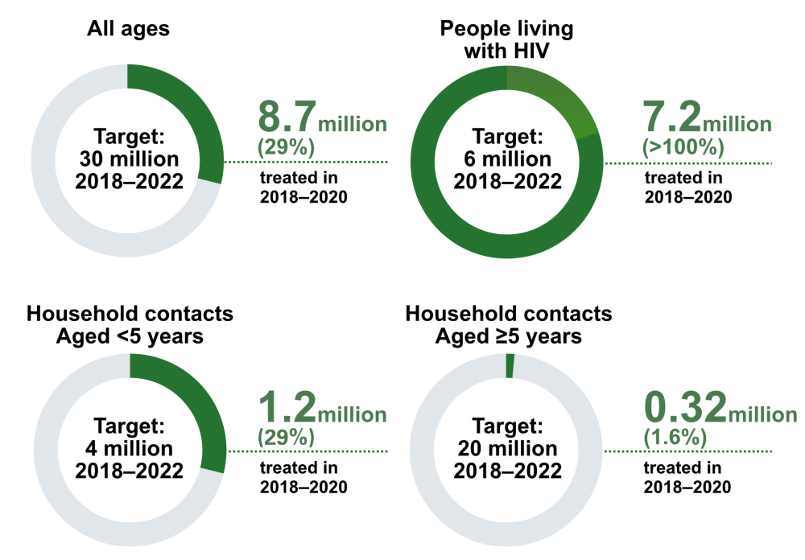

```{r setup, include=FALSE}
# Set chunk options.
# Results "asis" is useful to output markdown from a function
# Suppress messages, warnings and also the ## at the beginning of printed text

knitr::opts_chunk$set(echo = FALSE, 
                      results = "asis",
                      message = FALSE,
                      warning = FALSE)

# Kill any attempt at using factors, unless we explicitly want them!
options(stringsAsFactors=FALSE)


# Load output packages ----
# - - - - - - - - - - - - - - - - - - - - - - - - - - - - - - - - - -
library(ggplot2)
library(dplyr)
library(scales)
library(RColorBrewer)
library(whomap)
library(gtbreport)
library(here)

# load section data
source(here('report/ch4-dataprep.r'))

# Quick functions for callouts in the text to the figures/tables:

# 1. lnk() Creates a link from text to a named anchor)
lnk <- function(display_name){
  return(paste0('<span class="red">[', 
                display_name, 
                '](#', 
                gsub("[^a-zA-Z0-9]", "-", tolower(display_name)),
                ')</span>'))
}

# 2. anch() creates the named anchor to go above the figure or table
anch <- function(display_name){
  return(paste0('<a name="', 
                gsub("[^a-zA-Z0-9]", "-", tolower(display_name)),
                '"></a>'))
}

# 3. ref_lnk() creates a link from text to the references in the WHO style (black, italic)
ref_lnk <- function(display_name){
  return(paste0('<span class="refs">[', 
                display_name, 
                '](#refs)</span>'))
}


# rmarkdown::render(here::here("report/ch4-figs.rmd"), output_file = "ch4-figs.html", output_dir = here::here("report/html/"))

```


```{css, echo=FALSE}

/* Styles to make it easier to see in the html_fragment; this CSS can be included in the CSS widget of Sitefinity */
  
.section.level3 {
  padding-bottom: 1em;
  border-bottom: 1px solid #BCBCBC;
  margin-bottom: 2em;
}


.subhead, .footnote {
  font-size: 80%;
  font-weight: normal;
  margin-top: 0;
  padding-top: 0;
}

.red, .red a {
  color: #F21905; /* red text to show figure number */
  font-weight: bold;
}

.refs, .refs a {
  color: #3c4245;  /* match SF normal text colour */
  font-style: italic;
}

/* justify paragraphs to both left and right margins in the text under heading 2 */
.level2 p {
  text-align: justify;
  text-justify: inter-word;
}

```


_Draft! Prepared `r Sys.Date()` using country-reported data CSV files dated `r csv_datestamp` and estimates files dated  `r csv_estimate_datestamp`._


`r anch("Fig. 4.1")`

### <span class="red">Fig. 4.1</span> The global number of people provided with TB preventive treatment, 2015–`r report_year - 1`^a^


```{r fig_4.1, fig.alt="Bar chart showing numbers provided with TB preventive treatment each year since 2015"}

f4.1_plot <- f4.1_data %>% 
  
  ggplot(aes(x=year, y=how_many, fill = TPT_category)) +

  geom_bar(stat = "identity")  +

  geom_col(position = position_stack(reverse = TRUE)) +

  scale_x_continuous(name="",
                   breaks = 2015:(report_year-1)) +
  
  # display y-axis scale in millions
  scale_y_continuous(name = "Millions", 
                     labels = function(i){round(i/1e6)},
                     limits = c(0,4.5e6)) +

  scale_fill_manual("",
                    breaks = c("hiv_tpt", "house_con04_tpt", "house_con5plus_tpt" ),
                    labels = c("People living with HIV", "Contacts aged under 5", "Contacts aged 5 and over"),
                    values = c("hiv_tpt"="#ffc425",
                               "house_con04_tpt"="#9fcd25",
                               "house_con5plus_tpt"="dark green")) +


  theme_gtb() +
  # Get rid of annoying x-axis line and ticks
  theme(axis.line.x = ggplot2::element_blank(),
        axis.ticks.x = element_blank())

print(f4.1_plot)

```
<div class="footnote">^a^ The number of people living with HIV who were provided with TB preventive treatment in 2019 is lower than published in the 2020 Global Tuberculosis Report. This is due to an update of the data reported by India.</div>


`r anch("Fig. 4.2")`

### <span class="red">Fig. 4.2</span> Global progress in provision of TB preventive treatment 2018–2020 compared with cumulative targets set for 2018–2022 at the UN high-level meeting on TB


`r anch("Fig. 4.3")`

### <span class="red">Fig. 4.3</span> Percentage of household contacts of bacteriologically confirmed pulmonary new and relapse TB cases evaluated for active TB and TB infection, `r report_year - 1`

```{r fig_4.3, fig.alt="Map showing evaluation for active TB and TB infection among household contacts of confirmed pulmonary TB cases"}

f4.3_plot <- f4.3_data %>% 
  
  whomap(colours = brewer.pal(4, "Reds"),
         legend.title = "Percentage (%)",
         na.col = "white")

print(f4.3_plot)

```


`r anch("Fig. 4.4")`

### <span class="red">Fig. 4.4</span> Coverage of TB preventive treatment among eligible children aged under 5 years,^a^ `r report_year - 1` 


```{r fig_4.4, fig.alt="Map showing coverage of TB preventive treatment among eligible children aged under 5 years"}

f4.4_plot <- f4.4_data %>% 
  
  whomap(colours = brewer.pal(4, "Greens"),
         legend.title = "Percentage (%)",
         na.col = "white")

print(f4.4_plot)

```

<div class="footnote">^a^ Children aged <5 years who were household contacts of bacteriologically confirmed pulmonary TB cases.</div>


`r anch("Fig. 4.5")`

### <span class="red">Fig. 4.5</span> Completion of TB preventive treatment among contacts starting treatment,^a^ `r report_year - 2`

```{r fig_4.5, fig.alt="Panel plot showing percentage completion vs number started by WHO region"}

f4.5_plot <- f4.5_data %>% 
  
  ggplot(aes(x=newinc_con_prevtx, y=pct_completed)) +
  
  geom_point(size=3, colour = "#ff748c") +
  
  scale_x_continuous(name="Contacts starting TB preventive treatment",
                     labels = function(i){gtbreport::int_spacer(i)}) +
  
  scale_y_continuous(name = "% contacts who completed TB preventive treatment") +
  
  expand_limits(y = c(0, 100)) +

  facet_wrap( ~ entity, ncol = 3, scales = "free_x") +

  theme_gtb() +
  
  # Get rid of annoying x-axis line and ticks
  theme(axis.line.x = ggplot2::element_blank(),
        axis.ticks.x = element_blank())

print(f4.5_plot)

```
<div class="footnote">^a^ Each dot represents a country report.</div>


`r anch("Fig. 4.6")`

### <span class="red">Fig. 4.6</span> Provision of TB preventive treatment to people living with HIV^a^, 2005–`r report_year - 1`

```{r fig_4.6, fig.alt="Panel plots showing numbers of people living with HIV provided with TB preventive treatment each year since 2005 by WHO region and globally"}

f4.6_plot <- f4.6_data %>% 
  
ggplot() +
  geom_line(aes(x=year, y=hiv_tpt_new, colour = "Newly enrolled on HIV treatment"), size=1, linetype="dashed") +

  geom_line(aes(x=year, y=hiv_tpt_all, colour = "Currently on HIV treatment"), size=1, linetype="solid") +

  scale_x_continuous(name="",
                     breaks = c(2005, 2010, 2015, report_year-1)) +
  scale_y_continuous(name = "Number of people (thousands)",
                     # Use the remainder operator in the labeller function to make sure we don't get weird effects
                     # when plotting small numbers
                     labels = function(i){ifelse((i/1e3) %% 1 == 0, gtbreport::int_spacer(i/1e3), "")}) +
  
  # Need a colour scale for a legend to be shown
  scale_colour_manual(name="", values = c("Newly enrolled on HIV treatment" = "red",
                                          "Currently on HIV treatment" = "#277abe")) +
  
  expand_limits(y = 0) +

  facet_wrap( ~ entity, ncol = 4, scales = "free_y") +

  theme_gtb() +

  # Get rid of annoying x-axis line and ticks
  theme(axis.line.x = ggplot2::element_blank(),
        axis.ticks.x = element_blank())

print(f4.6_plot)

```
<div class="footnote">^a^ For the period 2005–2016, countries were requested to report data for people newly enrolled in HIV care (dashed lines). Subsequently, countries have been encouraged to report data for people currently on antiretroviral treatment (solid lines).</div>


`r anch("Fig. 4.7")`

### <span class="red">Fig. 4.7</span> The top six countries providing TB preventive treatment to people enrolled on HIV treatment, `r report_year - 1`

```{r fig_4.7, fig.alt=paste("Horizontal bar chart showing the provision of TB preventive treatment as a proportion of the global total for the top 6 countries in", report_year - 1)}

f4.7_plot <- f4.7_data %>% 

  # Keep record of current order (in reverse) so plot comes out as we want it
  mutate(country = factor(country, levels=rev(country))) %>%

  ggplot(aes(x=country, y=proportion)) +

  geom_bar(stat = "identity", fill = "#990083") +

  # display y-axis scale im thousands
  scale_y_continuous(name = "Percentage of global total",
                     labels = function(x) {paste0(gtbreport::int_spacer(x), "%")}) +
  
  # Remove the x-axis label
  labs(x = NULL) +

  coord_flip() +
  
  theme_gtb()  

print(f4.7_plot)


```


`r anch("Fig. 4.8")`

### <span class="red">Fig. 4.8</span> Use of rifapentine in TB preventive treatment regimens,^a^ by June 2021

```{r fig_4.8, fig.alt="Map showing countries using rifapentine for TB preventive treatment"}

f4.8_plot <- f4.8_data %>% 
  
  whomap(colours = c('#277abe', '#5ce1e6'),
         legend.title = "Status",
         na.col = "white")

print(f4.8_plot)

```

<div class="footnote">^a^ Rifapentine is currently registered for use in `r gsub("(Democratic)|(Philip)|(United)", "the \\1\\2\\3", sub("SAR", "Special Administrative Region", knitr::combine_words(f4.8_footnote$country,oxford_comma=FALSE)))` (source: Sanofi, June 2021). Several countries in which rifapentine is not yet registered have accessed it using local waiver mechanisms.</div>


`r anch("Fig. 4.9")`

### <span class="red">Fig. 4.9</span> Notification rate ratio of TB among health care workers compared with the adult population, `r report_year - 1`

```{r fig_4.9, fig.alt="Map showing ratio of TB notification rates among health care workers to those among the adult population"}

f4.9_plot <- f4.9_data %>% 
  
  whomap(colours = rev(brewer.pal(4, "Spectral")),
         legend.title = "Notification rate ratio",
         na.col = "white")

print(f4.9_plot)

```


`r anch("Fig. 4.10")`

### <span class="red">Fig. 4.10</span> BCG vaccination practices by country

```{r fig_4.10, fig.alt="Map showing BCG immunisation policies"}

f4.10_plot <- f4.10_data %>% 
  
  whomap(colours = c("#5f8b6d", "#9fe9b7"),
         legend.title = "Status",
         na.col = "white")
  
print(f4.10_plot)

```

<div class="footnote">Source: The BCG World Atlas 3rd Edition, http://www.bcgatlas.org/</div>


